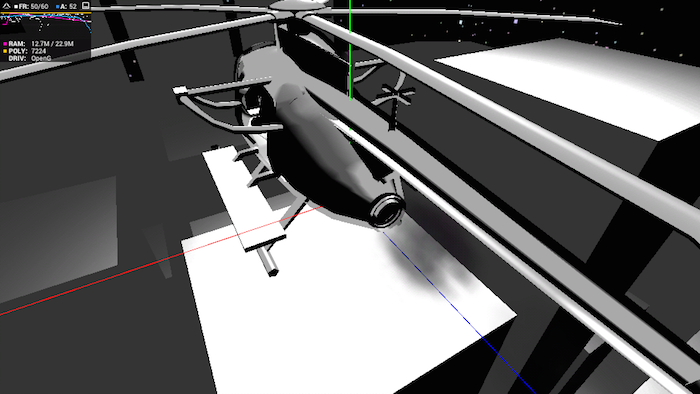

# MobileCopter

**An experiment with Android apps made with Adobe AIR. It's an interactive animation of an helicopter in 3D (Away3D), using a cell shading rendering**

**Creation date:** 11/2013

**Development time:** 2 weeks

**Requirements :**

- Adobe AIR
- Flex 4.6

**Functionalities :**

Just a technical demo. This experiment has no purpose at all.

**User's manual :**

1. Download AIR on the play store
2. Install APK
3. Touch events allows to pinch to zoom and rotate by dragging

**Screenshots**

